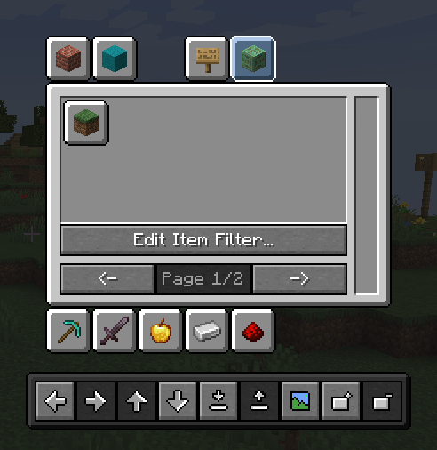

# TabManager
Tab Manager is a Minecraft Utility mod that allows you to restructure your whole creative inventory and filter out
items that you do not need. It allows you to have multiple configuration files and switch between them in-game.
You can share your configurations with friends or the community by exporting and importing configuration files.

## Features
- Restructure the tabs in your creative inventory
- Hide the tabs in your creative inventory
- Filter out items from your creative inventory that you do not need
  - Supports Regex and Glob filtering!
- Change icons of tabs in your creative inventory
- Multiple configuration files
- Export and import configuration files
- In-game configuration switching
- Easy to use GUI

## Minecraft Version
Currently available for 1.21.1

## Installation
1. Make sure you have Minecraft and Fabric Loader installed.
2. Download the latest version of Tab Manager from the [releases page](https://github.com/snackbag/TabManager/releases)
3. Place the downloaded .jar file into your `mods` folder located in your Minecraft directory.
4. Download OwoLib for the matching version: [Modrinth](https://modrinth.com/mod/owo-lib) or [CurseForge](https://www.curseforge.com/minecraft/mc-mods/owo-lib) or [GitHub](https://github.com/wisp-forest/owo-lib)
5. Place the OwoLib .jar file into your `mods` folder as well.
6. Launch Minecraft with the Fabric profile.

## Dependencies
The mod requires [OwoLib](https://github.com/wisp-forest/owo-lib) to function, which wraps vanilla GUI widgets from
Minecraft and provides additional functionality for mod developers. The dependency is licensed under the MIT License
and therefore freely available.

## Documentation
If you do not know how to use this mod, there's a basic documentation over [here](./docs/documentation.md) that should cover you.