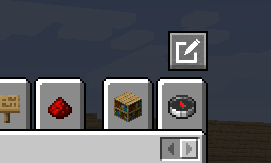
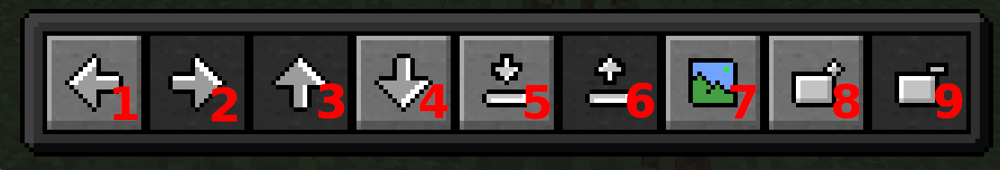
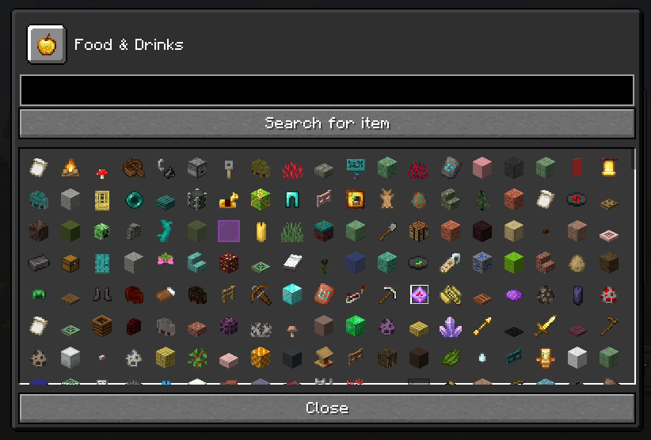
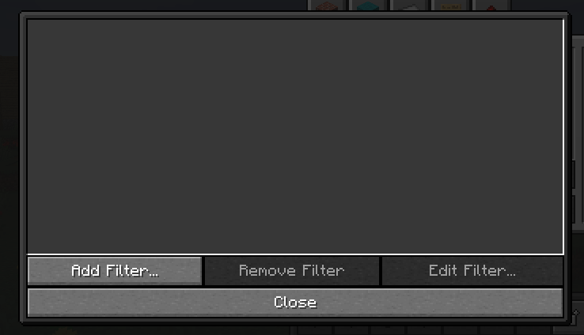
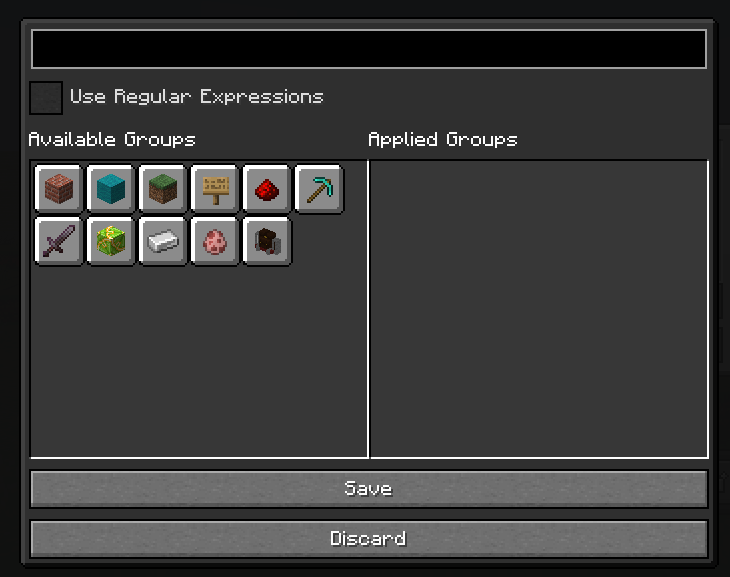

# Official Documentation for TabManager

## Overview
Tab Manager is a Minecraft Utility mod that allows you to restructure your entire creative inventory and filter out
items that you do not need. It supports multiple configuration files, enabling you to switch between them in-game.
You can share your configurations with friends or the community by exporting and importing configuration files.

## Table of contents
- [Features](#features)
  - [Opening the configuration GUI](#opening-the-gui) 
  - [Restructuring](#restructuring)
  - [The Tray](#the-tray)
  - [Changing the icon](#changing-the-icon)
  - [The item filter](#the-item-filter)

## Features

### Opening the GUI
To open the configuration GUI, just press the button with the pen in the top right corner of your creative menu, right
above the search tab:

right after, you should be greeted with a gui that allows you to edit almost _everything_:

### Restructuring
To restructure your inventory, you have the following controls available:

To get started, first select a tab you want to edit. If you haven't selected any tab, all the buttons except 8 and maybe
9 should be greyed out. This is normal.

We'll go over all the buttons below:

- **Button 1**: This button shows an arrows to the left. If you select a tab that cannot be moved to the left further,
this button will be greyed out. If you press this button, the selected tab will move to the left, and if there is already
a tab on the left, it will switch places with that tab.
- **Button 2**: This button does the same thing as **Button 1**, but moves the tab to the right instead of the left.
- **Button 3**: This button will move the selected tab to the upper row. It will switch places if there's another tab in
the place the button should move to. This button will be greyed out if the tab is already on the top row.
- **Button 4**: This button does the same thing as **Button 3**, but moves the tab on the lower row instead of the upper row.
- **Button 5**: This button will move the tab into the tray. More on that: [The Tray](#the-tray)
- **Button 6**: This button will move the tab from the tray into a free spot in the creative inventory. If there's no free
spot available, this button will be greyed out. In that case, move another tab into the tray first.
- **Button 7**: This button will allow you to change the icon of the selected tab. More on that: [Changing the icon](#changing-the-icon)
- **Button 8**: This button will append a page to the creative menu.
- **Button 9**: This button will remove the last page of the creative menu. If there are tabs in it, TabManager will search
for free spots on other pages and move them there. You cannot have less pages than you originally had without tweaks, hence
this button will be greyed out.

### The Tray
If you put tabs into the tray (see [Restructuring](#restructuring)), they will be hidden away from the creative menu.

You can also use the tray to store tabs to put them on other pages. To do that, first put the tab you want to move into the
tray, switch to another page and remove it from the tray there.

If there's no space on the current page to unload a tab, the button will be greyed out, and you will not be able to move
the tab into the page. In that case, first put another tab from that page into the tray to make space and move it afterward.

### Changing the icon
To change the icon of a tab, first select the tab in the creative menu and press the icon change button
(see [Restructuring](#restructuring))

You will be greeted with a menu like this:

If you click an item in the list, the tab will automatically change. If you can't find the item you're searching for,
there's a textbox on the top where you can enter your search query. It works basically the same as the standard creative
menu search, although you do have to press "Search for item" because if I implement the way so it searches automatically,
the performance takes a MASSIVE hit.

If you're finished doing this, you can either press escape to exit completely, or just the "Close" button to
go back to the Config GUI.

### The Item Filter
You can open the item filter with the "Edit Item Filter..." button in the configuration GUI. You can find the button right
below the tray.

You will see a GUI like this:

With the item filter, you can filter out any items you do not need. It supports both regular expressions and standard glob:

If you click "Add Filter...", a menu like this will pop up:

In the first textbox, you can add the predicate. This is either a glob or a regular expression:

Here's an example filtering out **all** wool blocks:
- Regular Expressions: e.g. ^minecraft:.+_wool$
- Glob: e.g. minecraft:*_wool

Glob is **exclusive**. You can only specify items you do **NOT** want. You cannot only include a item of one type and exclude all others
with one line. The NOT-Operator (!) is NOT supported.

Regular expressions are also mostly exclusive, although you can use a trick involving negative lookaheads to make the
filter exclude out everything else and leave only the thing you specified in the regex.

Here's an example to only leave "minecraft:(something)_wool" and exclude everything else: `^(?!minecraft:.+_wool$).*`

**If you use regular expressions, you _MUST_ tick the "Use Regular Expressions" checkbox**, otherwise it will be interpreted
as a glob and will do nothing.

By clicking on an item group, you can either add or remove it to or from the "Applied Groups" column.

Click save if you are happy, click discard if you want to give up.